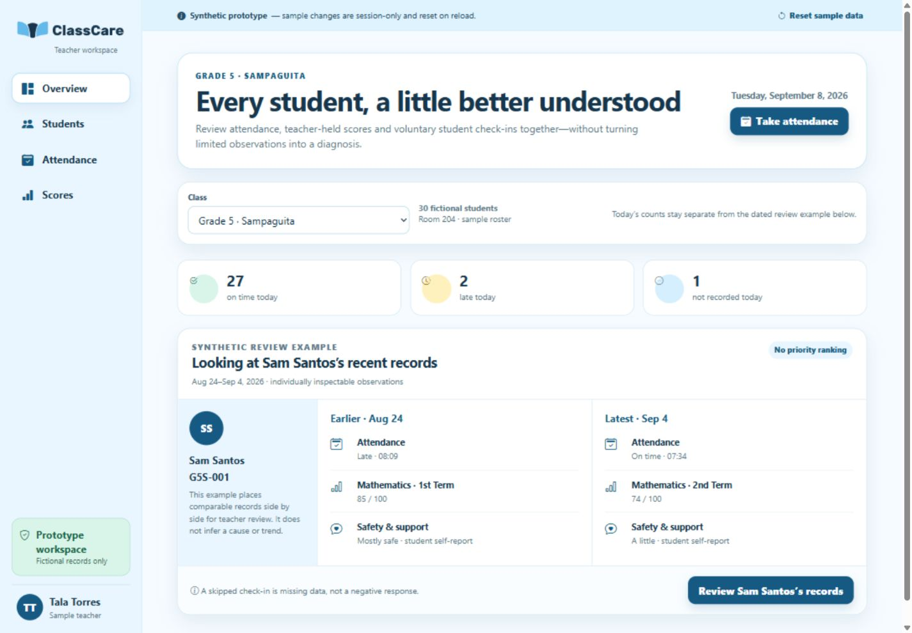
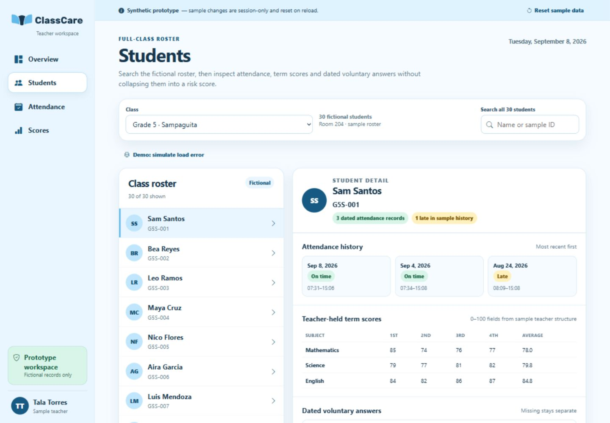
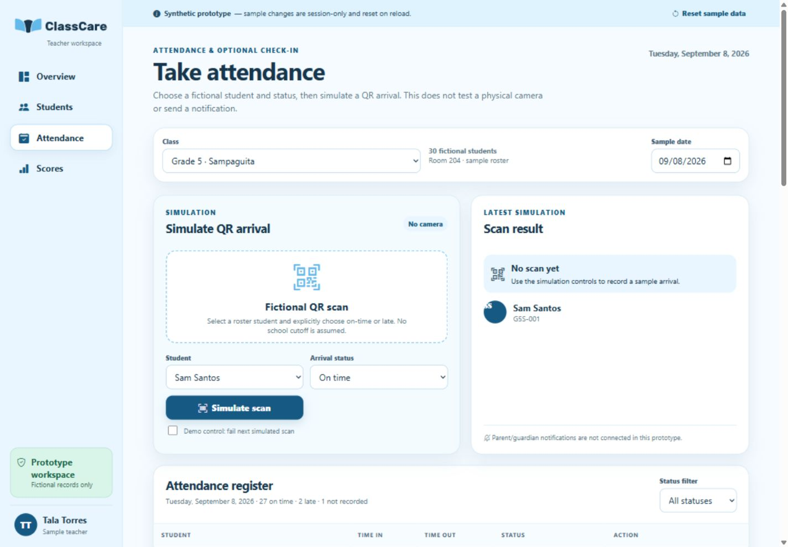
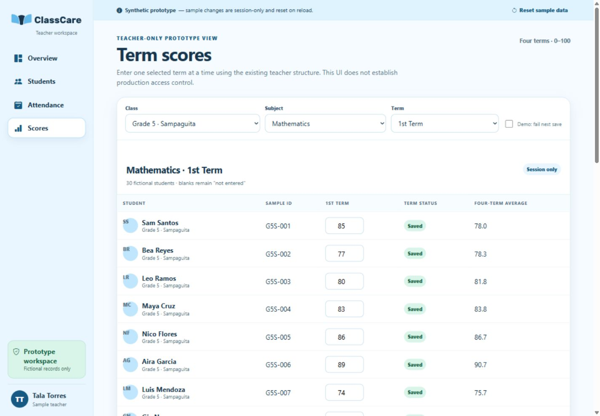
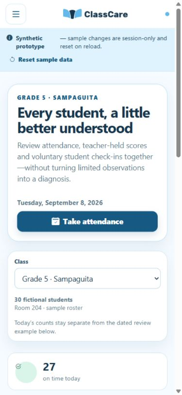

# Current prototype: focused alignment audit

Captured live in the in-app browser on September 12. Scope: Overview → student evidence → Attendance → Scores. Four desktop views at 1440×1000; Overview spot-checks at 390×844 and 768×1024. No prototype files changed. Selected sky-blue/Candidate 3 identity retained. This is a focused audit and revised specification, not full accessibility certification or acceptance of a redesigned build.

1. **Overview:** clear class/date and separated daily counts are strengths. The large promotional heading occupies most of the first phone screen; useful records appear substantially lower. Compact the hero and move task context above it. The comparison mixes term scores and old questionnaire answers and remains entirely synthetic: replace its values and labels, not merely its colors.

2. **Students/detail:** roster-and-detail composition supports comparison; dated history and explicit missing data are useful. The score range explicitly says 0–100 and the responses are the legacy five-question set. Add separate summative records and distinguish questionnaire types. Accessibility tree exposes roster items as checkboxes although the interaction selects one student; implementation should use clear single-selection semantics. Small muted secondary text needs measured contrast and zoom checks before acceptance.

3. **Attendance:** actions and results are separated clearly, but these are simulation controls. Replace the entire input workflow with the verified camera/manual-ID and transaction states. “Arrival status” selection is a demo convenience and must not override the school's configured timing rules. Keep optional Skip and a separate deep-check destination.

4. **Scores:** readable row structure and visible saved states are worth retaining. It only represents term grades; the new app also has summative assessments, thresholds, schedules and stale-editor protection. Split those workflows and keep all scores staff-only. The prototype's security disclaimer is not production copy.

5. **Phone/tablet:** navigation becomes a labeled menu; headings and controls reflow. The large hero and explanatory copy delay the main task, and full-class detail needs deliberate small-screen navigation. This run did not retest every mobile table, keyboard sequence, zoom level or contrast ratio. A transition screenshot was discarded and recaptured after the layout settled; a stitched full-page capture with a duplicate band was replaced by the exact viewport capture.

Recommendation: revise the existing design using FRONTEND_SPEC_V2.md. A new color/logo exploration would not address these feature mismatches.
