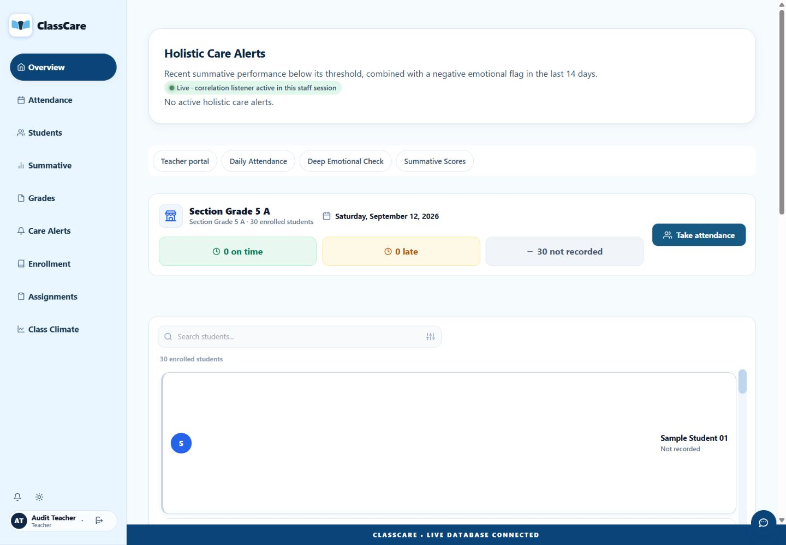
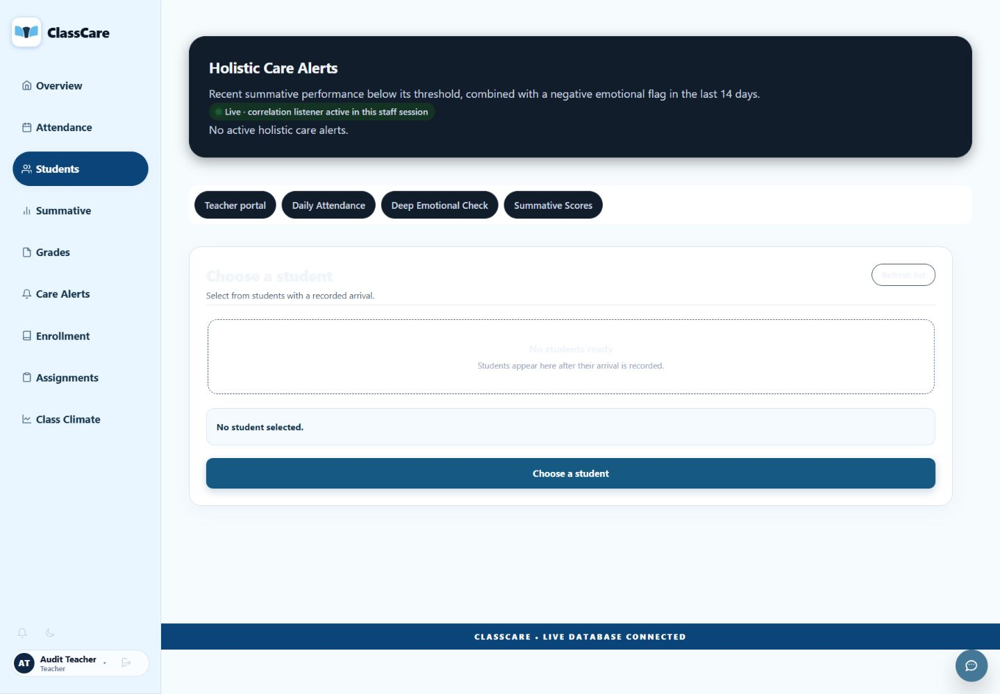
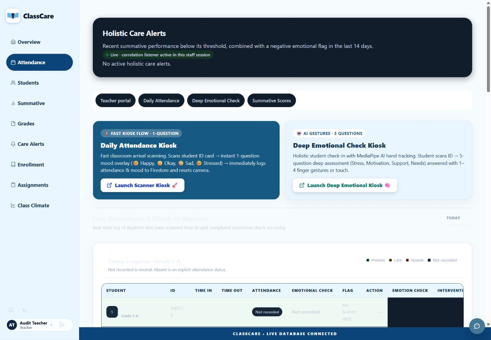
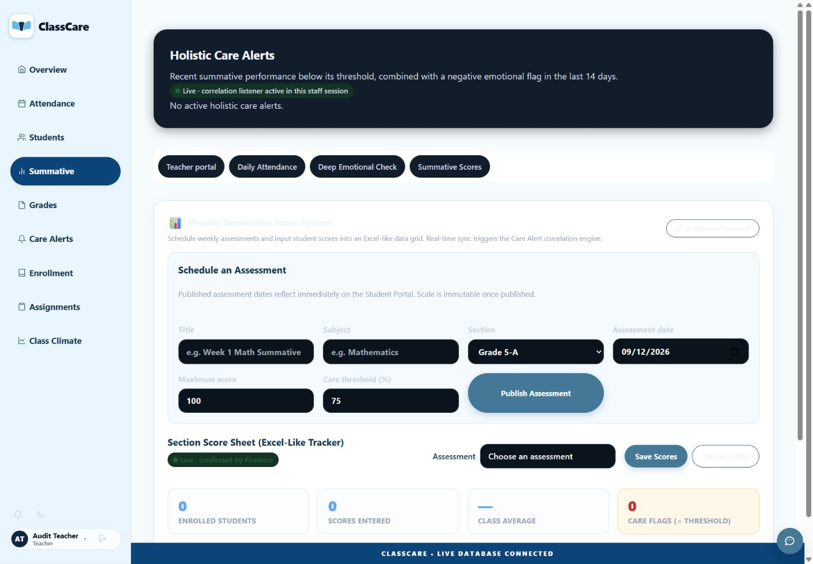
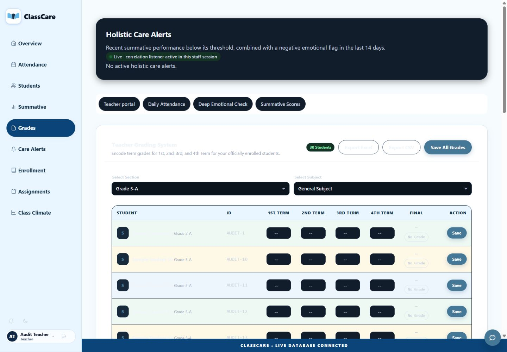
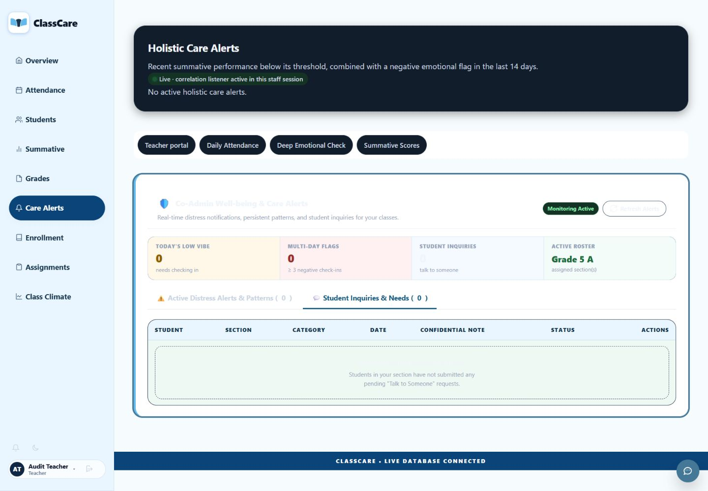

# Luna integration audit — September 12, 2026

Recommendation: keep the branch, but correct the issues below before continuing integration or merging. This is a partial presentation pass, not completed frontend alignment. No application source was changed during this audit.

## Scope and evidence

Reviewed the complete final diff and intervening commits from `a8ecf78` through `a692783` on `codex/classcare-frontend-integration`: `ac98f2d`, `ca3fb69`, `501cf04`, `62704b6`, `1191f05`, `7a9eb1f`, `a692783`. Earlier stabilization changes are outside this attribution boundary.

Current browser inspection used the loopback application, demo-classcare Auth/Firestore emulators, an approved fictional teacher and 30 fictional students. No production records or notification services were used. Screenshots were inspected at 1440 × 1000. Mobile redesign remains deferred.

## Findings

### 1. P1 — Supported dark theme makes important text unreadable

`teacher/overview-v3.css:48`, `:67`, `:71` and `:81` force white panel backgrounds while the existing dark theme retains pale text. The grade panel title computes to rgb(241,245,249) on white; several headings, labels and secondary controls nearly disappear. Reproduced in Students, Attendance, Summative, Grades and Care Alerts. The theme toggle remains available.

Use compatible theme tokens or explicit scoped dark styles for the new surfaces and their descendants. Verify both themes with actual content and focus/disabled states. Do not silently remove the working theme control.

### 2. P2 — Conflicting CSS breaks the intended compact Overview roster

`teacher/overview-v3.css:26` stacks the workspace. Its row-carousel rule at line 28 loses to existing column and 600px maximum-height `!important` declarations in `js/styles.css:3962`. The card's new `flex-shrink:0` combines with the inherited `flex:1 1 260px` at `js/styles.css:3250`.

With 30 students, the carousel measured 600px high, each visible student card 260px high, and the selected-record panel began 1353.6px below the viewport top. Large blank cards obscure the core review workflow. Reconcile the relevant selectors and flex sizing, then verify a full class against the accepted layout. Adding another broad override layer would deepen the problem.

### 3. P2 — New stylesheet is omitted from offline caching

`teacher/index.html:45` loads `overview-v3.css`, but `sw.js:3` does not include it in ASSETS. The fetch handler only handles listed URLs. The logo was added to that list; the stylesheet was not. Offline reload therefore has no service-worker fallback for the new design when the ordinary HTTP cache cannot supply it.

Add the stylesheet to the intended app-shell cache and verify an offline reload with the service worker enabled. This finding is established from code; a full offline reproduction was not run in this audit. The integration test blocks service workers and cannot validate this behavior.

### 4. P2 — Completion claims exceed actual integration and test coverage

Students still exposes the existing student-selection activity, not the planned searchable roster and individual evidence workspace. Preserving that activity avoids removing functionality, but styling it does not complete the agreed Students/detail integration. The live holistic surface also remains above all tabs under the dashboard parent; it is not an Overview-only layout.

`tests/integration.cjs:63` changes hashes directly. At line 69, Reports visibility is logged without an assertion. At line 76, scroll and layout geometry are logged without acceptance assertions. The logo assertion only checks the CSS URL string, not successful asset loading. A single-student fixture and an Overview-only capture cannot validate a full-class layout or the newly styled embedded score panels. The broader browser suite's standalone summative page is not equivalent to the embedded Summative tab.

Add narrowly targeted coverage: actual navigation clicks, 30-student layout, both themes, embedded score controls, and asserted Reports/scroll behavior. Update the screen-to-feature checklist so presentation completion is distinct from workflow integration. `docs/STATUS.md:8` and `:18` still say integration has not started and the branch does not exist, contradicting the branch and later completion notes.

### 5. P3 — Avoidable dead and brittle presentation code

The stylesheet retains selectors without matching final markup, including `.v3-more`, `#v3-evidence`, `.v3-evidence-card` and related presentation helpers. `.workspace-left-col` has repeated blocks. Attribute selectors matching literal inline-style strings are brittle. The integration harness duplicates substantial fixture/setup code from the existing browser harness and contains unused helpers/imports.

Remove confirmed unused rules and imports; use small explicit classes where necessary. No framework migration or broad refactor is warranted. Base rules affect every viewport despite the desktop-only milestone; deferring mobile redesign does not make these changes desktop-scoped.

## Existing issues exposed by the audit, not attributed to Luna

- Attendance introductory copy still describes a one-question check-in despite the current multi-step optional flow. Align the copy with verified behavior.
- Attendance displayed ten table headings with eight cells in an empty-state row. Check the existing dynamic column augmentation and empty-state structure.
- A student without a real score could display a summary containing `undefined/100`. Missing-score rendering needs an explicit empty state.
- Product-facing technical terms and illustrative-looking analytical summaries still need the agreed feature/copy alignment. Do not invent new thresholds or score policies during these corrections.

These require focused reproduction and baseline comparison before changing data behavior.

## Screen evidence

| Step | Screen | Result |
|---|---|---|
| 1 | Overview, light | Failed compact full-class layout; selected evidence below fold |
| 2 | Students, dark | Failed contrast; existing picker is not completed roster integration |
| 3 | Attendance, dark | Failed contrast; legacy copy/table issues visible |
| 4 | Summative, dark | Failed heading/control readability |
| 5 | Term grades, dark | Failed heading/control readability |
| 6 | Care Alerts, dark | Failed panel text readability |

`01-overview.png` is an excluded initial capture taken during viewport adjustment; use the replacement above.

## Verification and limits

- PASS: fresh `npm test`, 13/13 tests.
- PASS: `git diff --check a8ecf78..HEAD`.
- FAIL: fresh visual inspection, dark-theme contrast and full-class Overview layout.
- Reviewed historical browser/integration pass evidence; the full browser and rules suites were not rerun during this audit. Their earlier passes do not resolve these visual or coverage findings.
- NOT RUN: complete offline reproduction, mobile audit, physical-camera rehearsal, production deployment validation, and human usability evaluation.
- The final diff introduces no new application data listeners, analytics engine, authentication logic, database schema or framework. That is a useful preservation boundary, not proof that every existing feature works.

## Recommended next sequence

1. Correct theme compatibility and the Overview CSS conflict; inspect both themes with a full fictional class.
2. Restore offline stylesheet coverage and add the small missing regression assertions.
3. Remove dead presentation code and reconcile status/coverage documentation.
4. Reopen the accepted feature-to-screen map and finish the real Students/detail workflow alignment before the next integration slice.

Keep Candidate 3 branding, sky-blue direction, the existing stack and preserved application behavior. Continue mobile design last. Leave product-policy and significant architecture decisions for Astra review.
